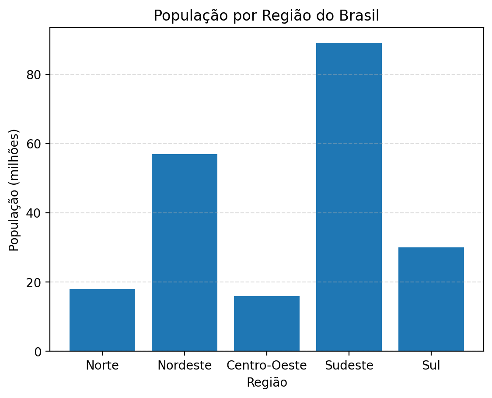
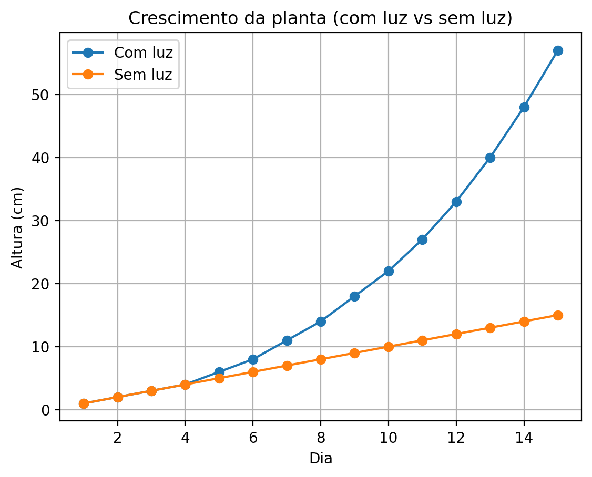
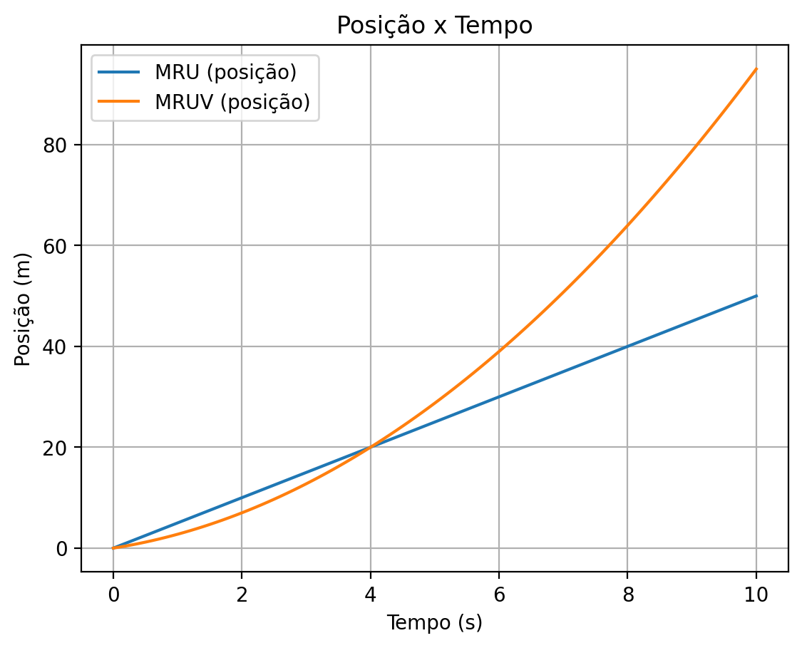

 
# STEAM — Aulas com Gráficos (Python)

Miniportfólio educacional com atividades de **Matemática, Geografia/Dados, Biologia e Física**, usando gráficos para facilitar a aprendizagem.

## Atividades (Notebooks)
- **01 Matemática:** função constante, 1º e 2º grau → `notebooks/01_matematica_funcoes.ipynb`
- **02 Demografia (Brasil):** população por região → `notebooks/02_geografia_demografia_brasil.ipynb`
- **03 Biologia:** crescimento de plantas (com luz vs sem luz) → `notebooks/03_biologia_crescimento.ipynb`
- **04 Física:** MRU e MRUV (posição, velocidade, aceleração) → `notebooks/04_fisica_mru_mruv.ipynb`

## Prévia dos gráficos

  
  

  
  

